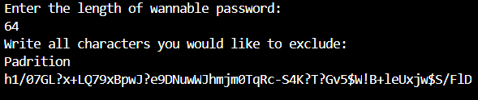

# passwordgen

This is my simple implementation of a password generator with PRNG.
I implemented it with a custom PRNG that uses time as a seed.

## Instalation 
To install it you need to clon this repository
```bash
git clone https://github.com/Padrition/passwordgen.git
```

## Usage 
* To run this programm you need to have a [rust compiler](https://www.rust-lang.org/learn/get-started) installed.

cd into the project folder 
```bash
cd passwordgen
```
And run
```bash
cargo run
```

You will be asked to enter the length of a password you want to be generated and characters you would like to exclude.
